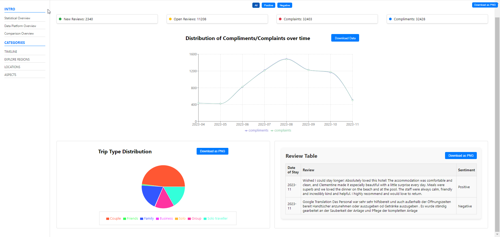

# Travel Review App

A feature-rich dashboard built with Node.js and React, designed to track customer review trends, perform sentiment analysis, and visualize key insights interactively. This project provides functionality to filter, analyze, and download visualized data, making it a powerful tool for understanding customer feedback.

---

## Table of Contents
- [Features](#features)
- [Technologies Used](#technologies-used)
- [Setup and Installation](#setup-and-installation)
- [Data Processing](#data-processing)
- [UI Features](#ui-features)
- [File Structure](#file-structure)
- [Usage](#usage)

---

## Features

1. **Data Analysis:**
   - Displays key statistics like new reviews, open reviews, complaints, and compliments.
   - Sentiment analysis to identify positive and negative reviews.

2. **Interactive Filters:**
   - Filter reviews by sentiment (All, Positive, Negative).
   - Display filtered data dynamically.

3. **Visualizations:**
   - Line chart to track review trends over time.
   - Pie chart to display trip types.

4. **Data Processing:**
   - Reviews filtered by date range (e.g., 2023-08-01 to 2023-11-01).
   - Handles data inconsistencies in date formatting.

5. **Download Functionality:**
   - Download the dashboard as a PNG image.

---

## Technologies Used

- **Frontend:** React.js, HTML, CSS
- **Data Parsing:** PapaParse
- **Visualization:** Recharts (Line and Pie Charts)
- **Data Export:** html2canvas

---

## Setup and Installation

1. **Clone the repository:**
   ```bash
   git clone https://github.com/gulkorkut/travel-review-app.git
   cd travel-review-app
   ```

2. **Install dependencies:**
   ```bash
   npm install
   ```

3. **Run the application:**
   ```bash
   npm start
   ```

4. **Access the application:**
   Open your browser and navigate to `http://localhost:3000`.

---

## Data Processing

- **Date Ranges:**
  - **New Reviews:** Reviews received on the last day of the month (2023-11-01).
  - **Open Reviews:** Reviews from 2023-04-01 to 2023-10-31 with an 'Open' status.

- **Statistics:**
  - **New Reviews:** Total reviews on 2023-11-01.
  - **Open Reviews:** Total 'Open' status reviews in the specified range.
  - **Complaints:** Total negative sentiment reviews.
  - **Compliments:** Total positive sentiment reviews.

- **Filtering:**
  - Filters reviews between 2023-08-01 and 2023-11-01 for analysis.

---

## UI Features

- **Filter Buttons:**
  - Located at the top of the dashboard.
  - Options: All, Positive, Negative reviews.

- **Sidebar:**
  - Sections with titles and dividers for navigation.

- **Download Button:**
  - Exports the dashboard view as a PNG image.

---
## Usage

1. **Start the server:** Follow the setup instructions above.
2. **Filter reviews:** Use the filter buttons at the top of the page to view All, Positive, or Negative reviews.
3. **Download the dashboard:** Click on the "Download as PNG" button to save the current dashboard view.
4. **Analyze trends:** Utilize the line chart and pie chart for visual insights.

---

### Full Page


